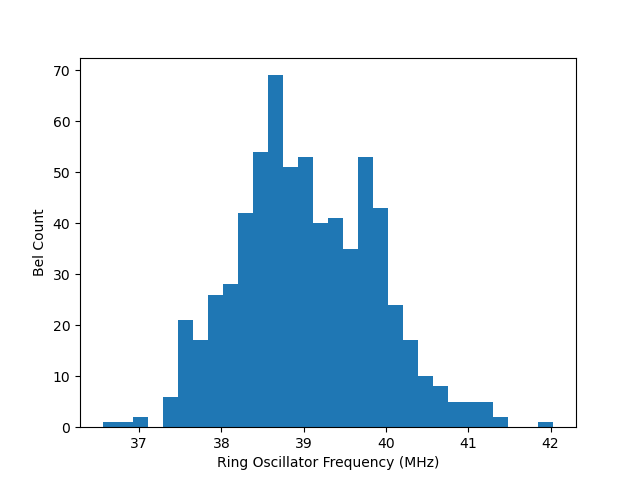
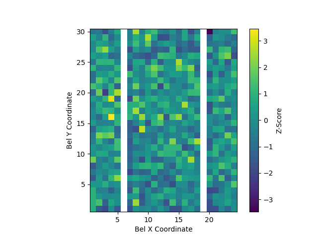
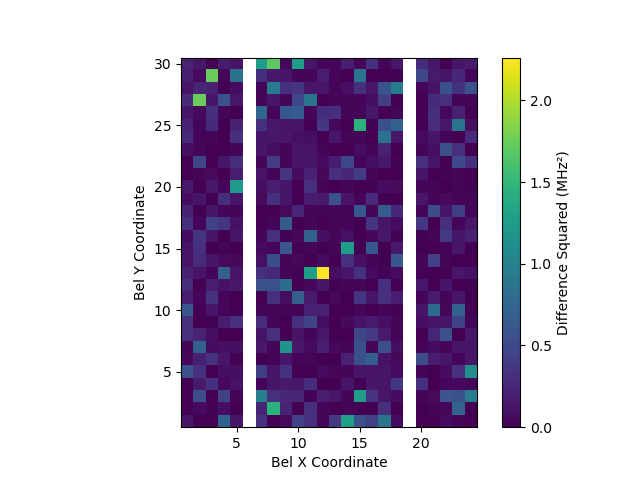

# Measuring Cross-Die Variations in FPGA Performance
This is a graduate-level term project in error-efficient computing.
Our project was to try measuring LUT speed for every tile individually on a Lattice iCE40 FPGA, using a 1BitSquared [iCEBreaker dev board](https://1bitsquared.com/collections/fpga/products/icebreaker).

## Paper Summary
Process variations are a constant in chip manufacturing, but these do not have to be a limitation.
In software systems, there is significant research into full-system support for approximation-aware computing, including programming languages, compilers, and runtime environments.
In FPGAs, though, this same treatment has not yet been applied to the equivalent stages of HDL, synthesis, and place-and-route.

Similar to the process variations in SRAM cells, performance varies across the die, but is locally consistent.
Measuring these variations is a prerequisite for place-and-route support in the same way that a map of RAM cell characteristics is a prerequisite for error-efficient memory allocation.

In this repository, we present a system to detect variations in lookup table performance on a commodity Lattice iCE40 FPGA.
Further, our convolution methodology is easily extended to measuring other characteristics, both for learning worst-case (or median) performance across a set of chips, and for customizing place-and-route for a specific chip.

In the future, it could become standard to run a data-collection cycle first, then apply that information during place-and-route to intelligently allocate slower and faster on-die resources to align with the programmer's annotations for error tolerance, clock domains, and even tradeoffs between the error (and speed) profiles of elements versus that of their interconnects.

## Prerequisites
You'll need to install the IceStorm open-source FPGA toolchain, including `yosys`, `nextpnr`, `icepack`, and `iceprog`. Then we're using Amaranth, so you'll need to install `amaranth` and `amaranth-boards` Python packages.

You can test if you have the toolchain installed by running [toolchain-test.py](gateware/toolchain-test.py). Blinky lights means it works!

You also need permission to program and connect to the FPGA over USB, which might require udev rules, adding your user to a group, or just running with `sudo` (depending on your distro). This repo should work alright on Windows or MacOS, but has only been tested on Linux (Manjaro and Fedora). Using a different OS should only require changing line 142 of [top.py](gateware/top.py).

## Running
Simply connect your iCEBreaker dev board over USB and run [run-tests.py](run-tests.py) to measure ring oscillator speed for each tile.
This will produce `results.json` which contains oscillator speeds over 100 samples for each tile.
This output file can then be analyzed with [stats.py](results/stats.py) to produce plots like those below.

## Results
Each row is a different chip. Pull requests welcome to incorporate more data!

|Histogram|Plot|
|---------|----|
|||
|||

(A Z-score is the number of standard deviations from the mean. The while columns are RAM tiles.)

Full-die stats results (aggregating data between each tile). All number in MHz. The take-away is that there is statistically-significant variation between tiles.

|Chip| Min | Max |Mean |StDev |
|----|-----|-----|-----|------|
| 0  |36.38|42.19|39.02|0.8665|
| 1  |35.81|42.00|39.01|0.8645|

And here are per-tile stats, calculated from each tile's individual standard deviation across its 100 samples. The takeaway is that each tile is remarkably consistent on its own.

|Chip| Mean of StDev| StDev of StDev|
|----|--------------|---------------|
| 0  | 0.03265      | 0.04891       |
| 1  | 0.05949      | 0.06043       |

In addition to the plots above, we also compared between two development boards and found these differences:

There is a peak signal-to-noise ratio of 33 dB between the first and second boards.

This means that there is significant variation across the board, but for each tile the performance is very consistent. There's also a lot of similarity between boards.
